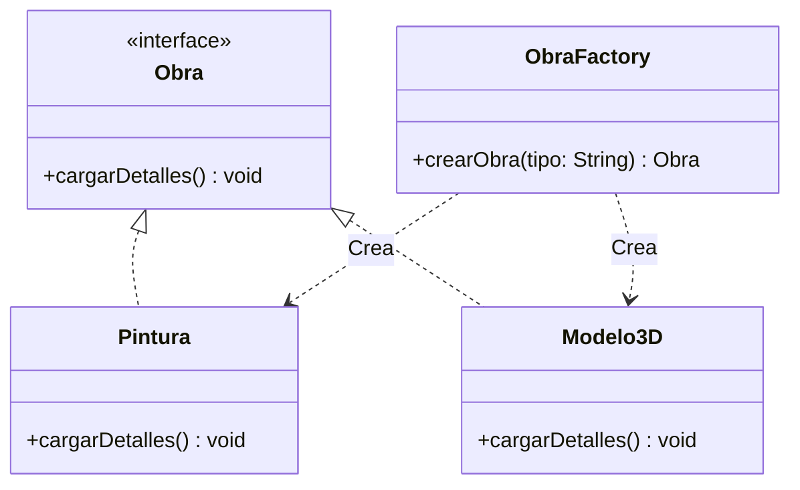
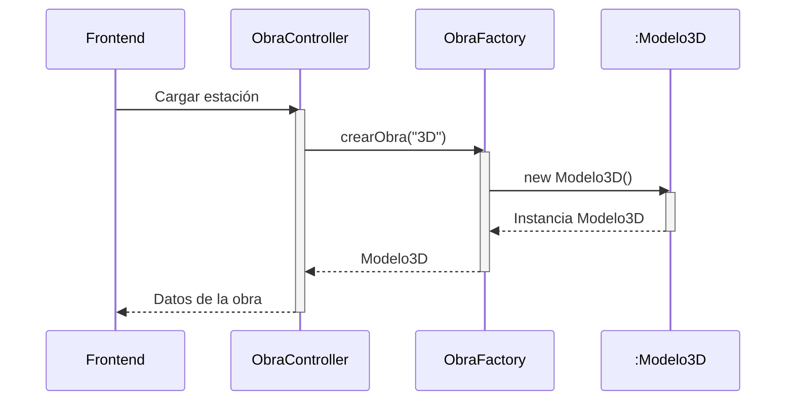
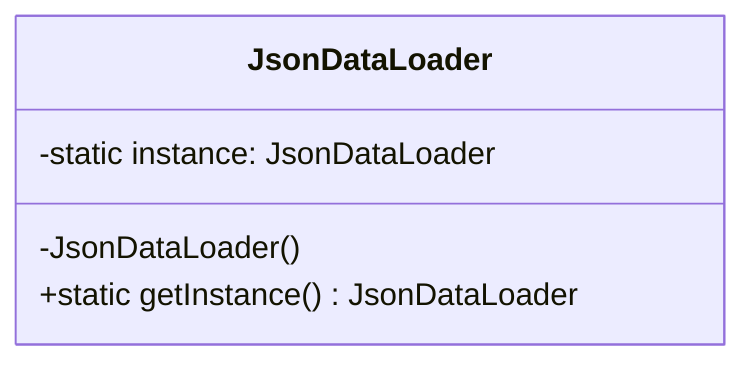
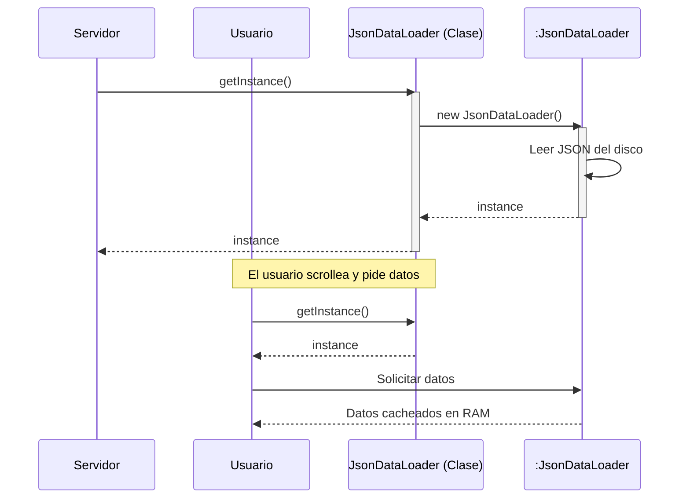
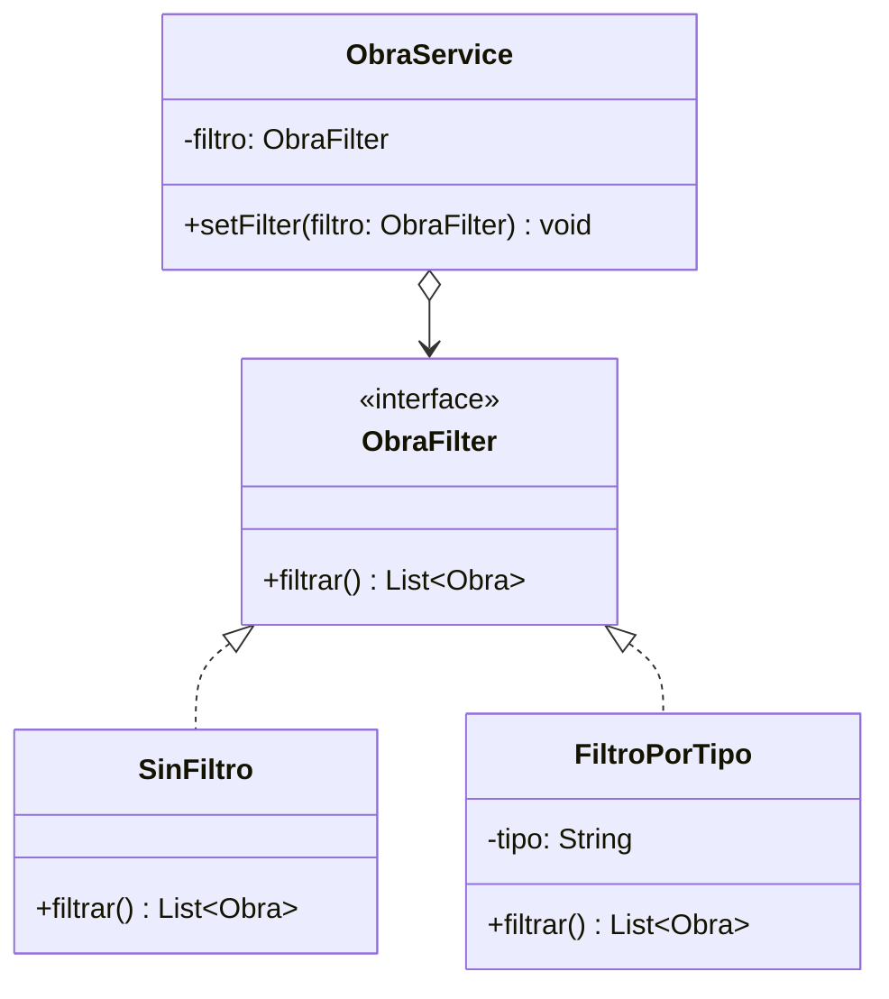
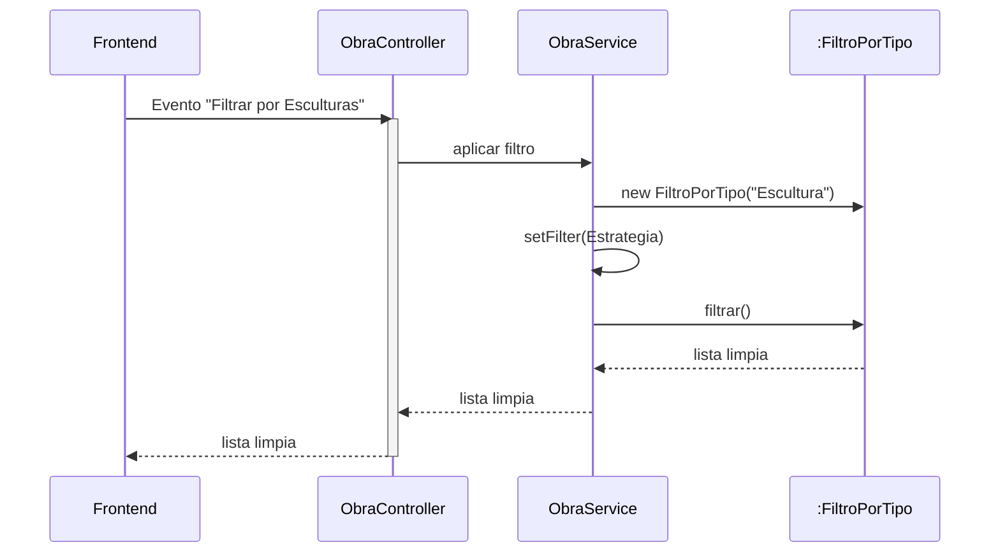
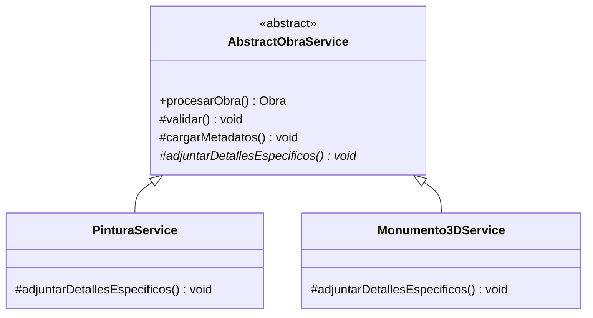
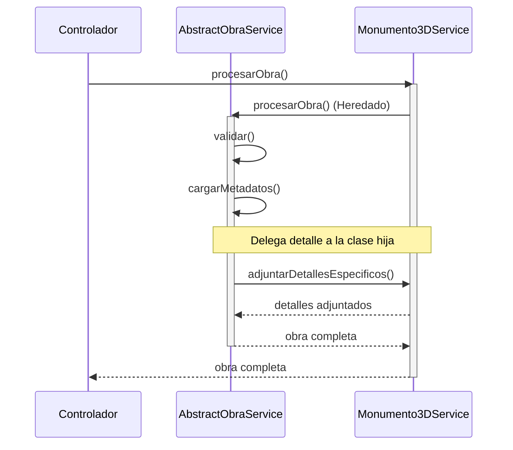

# Entregable Final: Módulo Funcional "Museo Virtual 3D"

A continuación se detalla la resolución de la problemática planteada, abarcando la especificación de la arquitectura Backend (4 patrones de diseño GOF), las metodologías de experiencia de usuario (UX/DCU/HCI) aplicadas en el Frontend, y ejemplos del código.

---

## 1. Patrones de Diseño (Backend)

### 1.1 Patrón Factory Method
- **Nombre del Patrón:** Factory Method (Creacional).
- **Propósito:** Definir una interfaz para crear un objeto, pero dejar que las subclases decidan qué clase instanciar, promoviendo el bajo acoplamiento.
- **Motivación:** En el recorrido 3D, el museo debe instanciar y enviar datos de diferentes tipos de obras (Pinturas en 2D, Monumentos 3D). Si el Controlador instancia estas clases usando múltiples `if/else`, el sistema se vuelve rígido. La fábrica soluciona esto centralizando la creación y permitiendo agregar nuevos formatos (ej. "Reliquias de audio") sin romper el código principal.
- **Estructura (Clases):**

- **Participantes:** 
  - `Obra` (Interface/Product): Contrato común para todas las piezas del museo.
  - `Pintura`, `Modelo3D` (ConcreteProducts): Implementaciones reales.
  - `ObraFactory` (Creator): Se encarga de evaluar el "tipo" solicitado y fabricar el objeto correcto.
- **Colaboración (Secuencia):**


### 1.2 Patrón Singleton
- **Nombre del Patrón:** Singleton (Creacional).
- **Propósito:** Garantizar que una clase tenga una única instancia en toda la aplicación y proporcionar un punto de acceso global a ella.
- **Motivación:** El museo depende de un archivo JSON pesado que contiene toda la configuración estructural y las descripciones largas de las obras. Leer el disco cada vez que un usuario hace scroll colapsaría el sistema. Usamos Singleton para leer el JSON una sola vez al arrancar el servidor (Spring Boot) y mantener esa estructura en memoria RAM compartida.
- **Estructura (Clases):**

- **Participantes:**
  - `JsonDataLoader`: Posee un constructor privado y un atributo estático de sí misma, controlando el acceso estricto a su creación.
- **Colaboración (Secuencia):**


### 1.3 Patrón Strategy
- **Nombre del Patrón:** Strategy (Comportamiento).
- **Propósito:** Definir una familia de algoritmos, encapsular cada uno de ellos y hacerlos intercambiables en tiempo de ejecución.
- **Motivación:** Permitir al usuario filtrar dinámicamente qué obras visualizar en la interfaz (Ej: "Solo Esculturas" o "Todo"). En lugar de tener un servicio inflado de lógicas de filtrado anidadas, cada filtro es una estrategia independiente, favoreciendo el principio Open/Closed de SOLID.
- **Estructura (Clases):**

- **Participantes:**
  - `ObraService` (Contexto): Recibe peticiones pero delega la tarea de limpieza a la estrategia inyectada.
  - `ObraFilter` (Strategy): Interfaz para los filtros.
  - `SinFiltro`, `FiltroPorTipo` (ConcreteStrategies): Implementan cómo limpiar la lista de obras.
- **Colaboración (Secuencia):**


### 1.4 Patrón Template Method
- **Nombre del Patrón:** Template Method (Comportamiento).
- **Propósito:** Definir el esqueleto de un algoritmo en una operación, delegando algunos pasos a las subclases sin cambiar la estructura del algoritmo.
- **Motivación:** Cuando el backend procesa los datos de una obra para enviarlos, siempre debe ejecutar validaciones de seguridad y cargar metadatos estándar (autor, época). El Template Method impone esta plantilla general en la clase abstracta padre, y solo delega a las hijas el manejo específico de los activos (procesar imágenes vs procesar archivos STL 3D).
- **Estructura (Clases):**

- **Participantes:**
  - `AbstractObraService` (AbstractClass): Define la plantilla inmutable en `procesarObra()`.
  - `PinturaService`, `Monumento3DService` (ConcreteClasses): Proveen la implementación particular de los métodos abstractos.
- **Colaboración (Secuencia):**


---

## 2. Análisis de Usuarios y Arquitectura de la Información (DCU)
- **Usuario Objetivo (Personas):** Orientado al público general interesado en la historia y el arte, abarcando edades desde los 15 hasta los 65+ años (estudiantes y aficionados). Su nivel técnico es básico a intermedio: saben navegar en internet, usar el ratón y los gestos móviles (scroll), pero pueden marearse o perderse si se les presentan interfaces 3D complejas similares a videojuegos.
- **Arquitectura de la Información:** Se optó por un modelo **Secuencial/Lineal** cerrado, también conocido como "Recorrido Guiado". A diferencia de una malla de enlaces caótica, el museo ordena jerárquicamente las obras (estaciones). La navegación no exige tomar decisiones de desplazamiento espacial (X, Y, Z); el usuario simplemente consume la narrativa a su propio ritmo dictado por la progresión natural del contenido.

## 3. Prototipado Rápido (Wireframes/Mockups)
*(Nota: Aquí deberás pegar las imágenes de tus wireframes realizados en Figma, Excalidraw, o Miro. A continuación se describe conceptualmente el layout esperado).*
1. **Landing/Hero Screen (Estado 0):** Toda la pantalla muestra el túnel 3D con baja luminosidad. En el centro exacto, se ubica una indicación parpadeante: *"Scrollea hacia abajo para comenzar el recorrido"*. Un ícono de flecha o un mouse animado refuerzan la interacción esperada.
2. **Estación de Obra (Estado 1):** La cámara 3D se frena. En el lado derecho (o izquierdo) de la pantalla aparece un panel flotante de **Glassmorphism** (vidrio esmerilado). El panel contiene: Jerarquía 1 (Título en tipografía Serif), Jerarquía 2 (Autor y Año), y Párrafo descriptivo. 
3. **Menú Global:** Un botón discreto estilo "hamburguesa" fijo en la esquina superior izquierda, y un panel de filtros de obras fijo en la superior derecha para aplicar dinámicamente las estrategias de búsqueda sin abandonar la escena.

## 4. Defensa de la Interfaz (UX/HCI)
El diseño resuelve múltiples factores humanos clave basándose en metodologías HCI dictadas en la materia:
- **Reducción de Carga Cognitiva:** Se utilizó la técnica del **Scrollytelling** (Storytelling manejado por scroll). Al atar la rotación y posición de la cámara 3D al evento natural del scroll del navegador, se elimina la necesidad de aprender esquemas de controles de teclado/mouse (WASD/Click-drag), previniendo la frustración en usuarios no gamers.
- **Metáforas de la Vida Cotidiana:** 
  1. *El Recorrido de Museo:* El entorno simula físicamente un pasillo abovedado, con pinturas espaciadas y enmarcadas. La disposición física indica intuitivamente dónde debe mirar la persona.
  2. *Luz Focal / Spotlights:* Se utilizan luces cenitales apuntando a las obras, guiando subconscientemente la atención del ojo humano basándose en la Heurística del Contraste y la Ley de Prägnanz (simplicidad y destacar lo importante).
- **Diseño Inclusivo:** Para asegurar legibilidad, las descripciones no flotan "crudas" en el aire 3D, sino que se proyectan sobre paneles superpuestos 2D translúcidos que aseguran un contraste óptimo frente al modelo 3D iluminado (cumpliendo con estándares de accesibilidad WCAG).

---

## 5. Ejemplo de Código Funcional

### Backend (Java - Spring Boot)
Ejemplo de inyección del patrón **Strategy** en un controlador REST de Spring Boot para filtrar obras dinámicamente.

```java
package com.museo.backend.controller;

import org.springframework.web.bind.annotation.*;
import com.museo.backend.service.*;
import com.museo.backend.model.Obra;
import java.util.List;

@RestController
@RequestMapping("/api/obras")
public class ObraController {

    private final ObraService obraService;

    // Inyección de dependencias por constructor
    public ObraController(ObraService obraService) {
        this.obraService = obraService;
    }

    @GetMapping
    public List<Obra> obtenerObras(@RequestParam(required = false) String tipoFiltro) {
        
        // Aplicación del Patrón Strategy basado en el parámetro
        if (tipoFiltro != null && tipoFiltro.equalsIgnoreCase("escultura")) {
            obraService.setFilter(new FiltroPorTipo("Escultura"));
        } else if (tipoFiltro != null && tipoFiltro.equalsIgnoreCase("pintura")) {
            obraService.setFilter(new FiltroPorTipo("Pintura"));
        } else {
            obraService.setFilter(new SinFiltro());
        }

        return obraService.filtrarObras();
    }
}
```

### Frontend (JavaScript + Three.js)
Ejemplo de cómo el Frontend captura el evento natural del scroll para impulsar el recorrido lineal 3D (**UX/HCI - Scrollytelling**).

```javascript
// Variable que guarda el progreso actual del usuario
let scrollProgress = 0;

// Escuchar el evento estándar de navegación (User-Centered Design)
document.addEventListener('wheel', (event) => {
    // Transformar el scroll 2D del mouse/trackpad en un movimiento 3D
    const delta = event.deltaY * 0.005;
    scrollProgress += delta;
    
    // Limitar los extremos para evitar salir del museo virtual
    scrollProgress = Math.max(0, Math.min(scrollProgress, 100));
    
    moverCamara(scrollProgress);
});

function moverCamara(progress) {
    // Interpolar la posición Z de la cámara basado en el scroll
    // Esto resuelve el factor humano evitando que el usuario navegue hacia las paredes
    camera.position.z = -progress * 5; 
}
```
