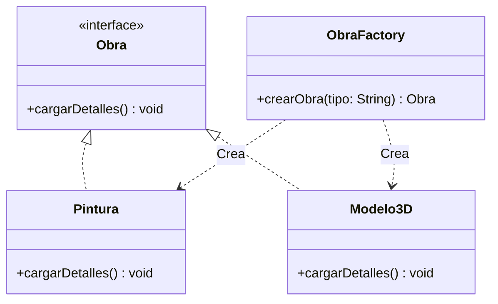
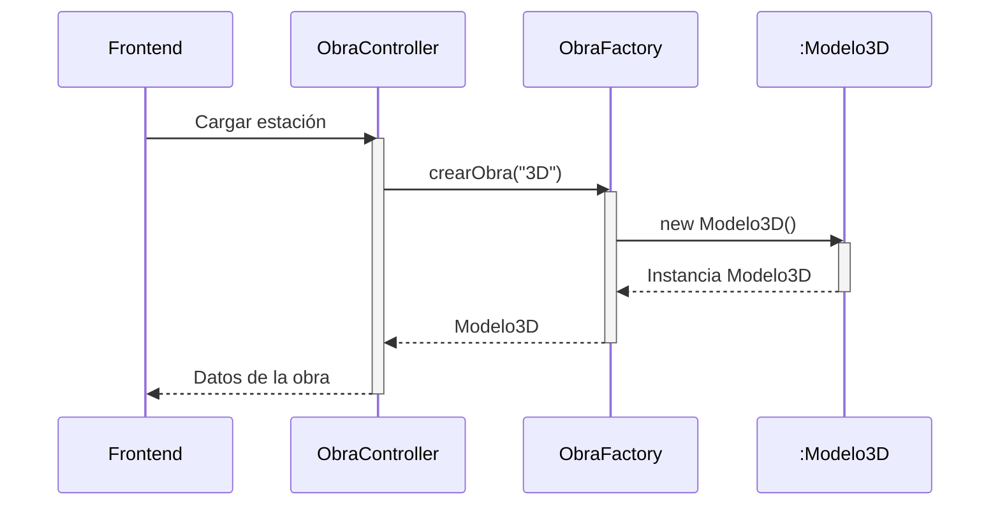
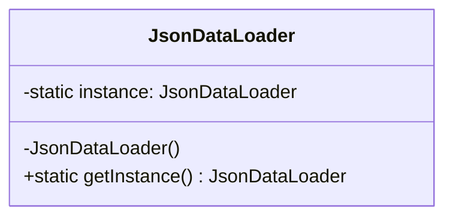
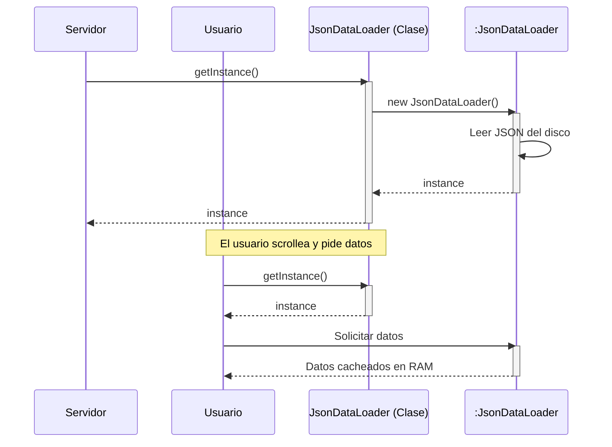
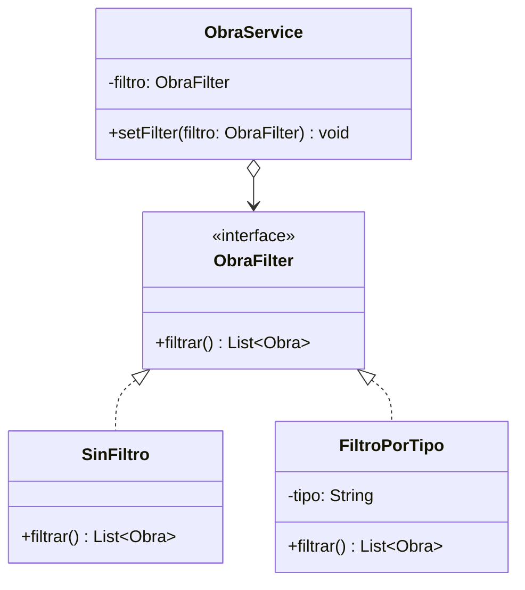
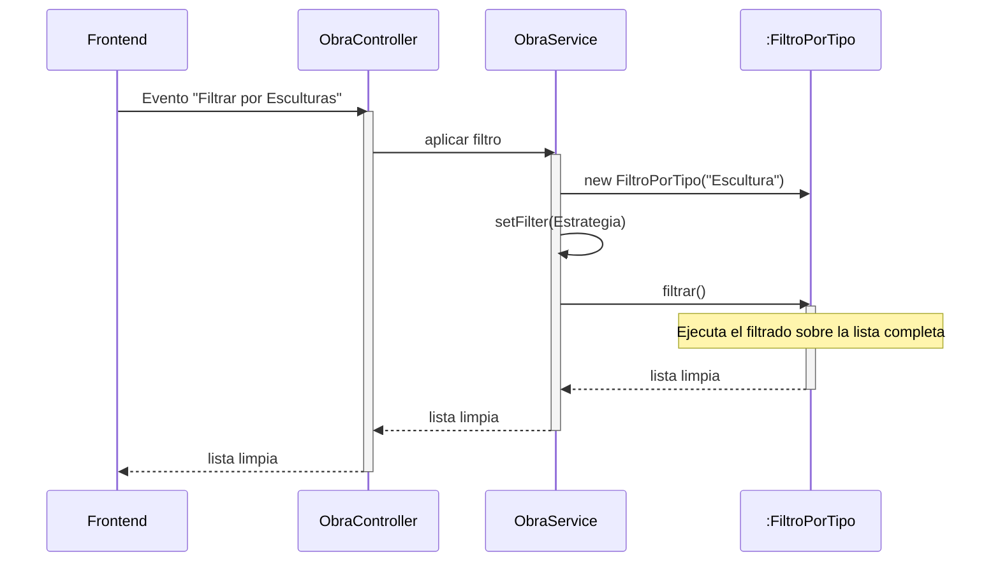
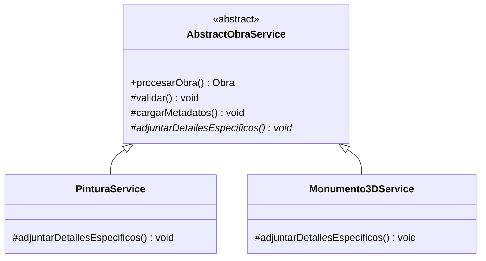
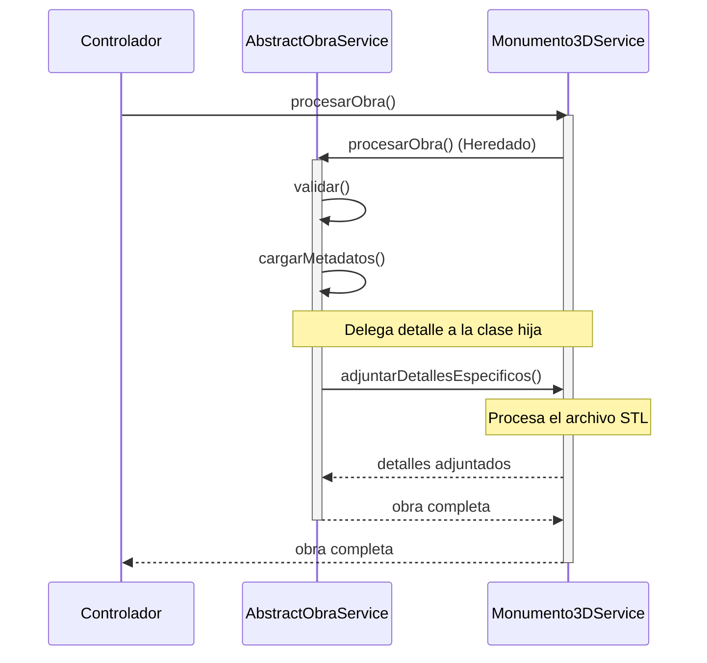

# Diagramas UML para Patrones de Diseño - Museo Virtual 3D

## 1. Patrón Factory Method (Creacional)

Contexto: Se encarga de instanciar el tipo de obra correcta según la estación del recorrido 3D en la que se encuentre el usuario.

### Diagrama de Clases (Estructura)

### Diagrama de Secuencia (Interacción)

---

## 2. Patrón Singleton (Creacional)

Contexto: Carga y mantiene en memoria la configuración pesada del museo y las rutas de los archivos (JSON) una sola vez al arrancar el servidor para no saturar lecturas en disco.

### Diagrama de Clases (Estructura)

### Diagrama de Secuencia (Interacción)

---

## 3. Patrón Strategy (Comportamiento)

Contexto: Permite al usuario filtrar dinámicamente qué tipo de obras ver en su recorrido.

### Diagrama de Clases (Estructura)

### Diagrama de Secuencia (Interacción)

---

## 4. Patrón Template Method (Comportamiento)

Contexto: Define los pasos estrictos para procesar los datos de una obra y enviarlos al frontend, delegando detalles específicos a las subclases.

### Diagrama de Clases (Estructura)

### Diagrama de Secuencia (Interacción)

